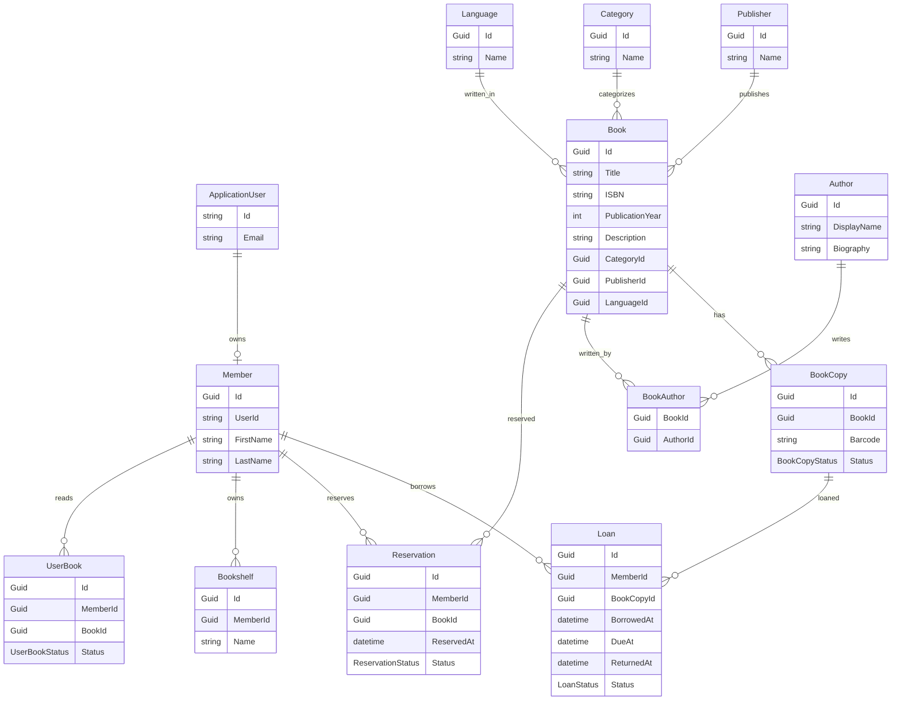

# Entity Relationship Diagram (ERD)

This document describes the current database structure of **ALIbrary**.

The system is implemented using **Entity Framework Core** with SQL Server.

---

# Entity Relationship Diagram

---

# Relationship Summary

| Relationship          | Cardinality               |
| --------------------- | ------------------------- |
| Publisher → Books     | One-to-Many               |
| Category → Books      | One-to-Many               |
| Language → Books      | One-to-Many               |
| Book → BookCopies     | One-to-Many               |
| Book ↔ Authors        | Many-to-Many (BookAuthor) |
| Member → Loans        | One-to-Many               |
| BookCopy → Loans      | One-to-Many               |
| Member → Reservations | One-to-Many               |
| Book → Reservations   | One-to-Many               |
| Member → Bookshelves  | One-to-Many               |
| Member → UserBooks    | One-to-Many               |

---

# Design Notes

* **Book** represents a bibliographic record, not a physical copy.
* **BookCopy** represents individual physical copies available for borrowing.
* **BookAuthor** implements the many-to-many relationship between books and authors.
* **Loan** references a **BookCopy**, allowing multiple copies of the same title to be borrowed independently.
* **Reservation** targets a **Book** rather than a specific copy, allowing the system to assign the next available copy in future implementations.
* **Member** extends an authenticated **ApplicationUser**, separating identity management from library-specific information.
* Lookup entities (**Category**, **Publisher**, and **Language**) normalize shared metadata and avoid duplication.

---

# Current Status

Implemented entities:

* ✅ ApplicationUser
* ✅ Member
* ✅ Book
* ✅ Author
* ✅ BookAuthor
* ✅ BookCopy
* ✅ Loan
* ✅ Reservation
* ✅ Publisher
* ✅ Category
* ✅ Language
* ✅ Bookshelf
* ✅ UserBook

The schema is designed to support future enhancements such as reporting, inventory tracking, overdue processing, and automated reservation fulfillment without major structural changes.
